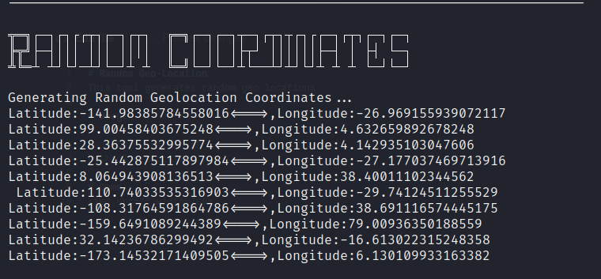

# 🌎 Random Geo-Location
This tool generates random geo locations.

# Usage
```bash
sudo bash install.sh
python3 geolocation.py 
```
# Functionality
```py
import geopy
from geopy.geocoders import Nominatim
from geopy.extra.rate_limiter import RateLimiter
latitude = input("Latitude: ")
longitude  = input("Longitude: ")
def reverse_geo_locate(lat,long): 
 locator = Nominatim(user_agent='Geo_Locator')
 coordinates = lat,long
 location = locator.reverse(coordinates)
 location.raw
 print(location)
reverse_geo_locate(latitude,longitude)
```
Consider reverse_geo.py for locating the coordinates.

# Demo 


# Covid-19 Awareness
If you ever want to go outside just wear a 😷 mask.


